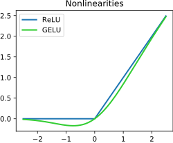

# mlp
Building an multi-layer perceptron by hand to build my understanding of the fundamentals.

### What is a Multi-Layer Perceptron (MLP), and why the name?

The name comes from the 1950's when a guy called Frank Rosenblatt introduced the single-layer perceptron, then it was seriously picked up by Geffory Hinton in the 80's [1]. 

The fact that the name MLP was coined in the 50's is reason enough why it is called a perceptron, every second new invention back then was some sort of 'tron'.

## Definition of MLP
An MLP is a type of neural network. So, let's start by defining what a neural network is. A neural net is a collection of nodes with different 'strength' connections between eachother. The gains, or 'strength', of the connections between nodes are called weights, which are tuned during a training process to embed knowledge in the network. This knowledge is accessed when a signal, which would often be a numerical expression for some input sentence, is passed through the network of nodes.

An MLP is a neural net with a very particular structure. It has an input layer, an output layer, and some number 'n' of layers sandwiched between the input and output layers. The middle layers are called 'hidden' layers. 

**Why is it structured in a sandwich like this? Well:**
- the input layer is just the entry point for your data. It is shaped depending on what your input data looks like, it's 'shape'. 
- the output layer is determined by the shape of your desired output. If it's words then you'll need a layer with a node/neuron (they're used interchangably) for each element of your vocabulary (a vocab is often not expressed by words, but often by chunks of words + words, like 'ing')
- the middle layers
    - first, if you didn't have the middle, then you would be mapping the inputs directly to the outputs, which is a *linear* relationship!
    - we want to represent more complex things than just linear relationships, which is why we introduce more layers. Note that this can be achieved by one massive single layer representing all possibly necessary functions, or, as it is done in practice, many layers of neurons stacked in series. It turns out that if you stack the layers you need fewer neurons in total vs one enormous single layer. 

## Weights, Biases, and the difference between them
The network of nodes expresses knowledge and relationship by each connection between nodes having a weight, and each node itself having a bias. The weights we have already gone over, those are the strengths between different nodes. Thinking geometrically, they are the slope and tilt of the activation of the node. They are expressed below as $w_n$. The previous nodes in the layer of n nodes preceeding the node we're inspection are represented by $x_n$ in the below equation.

Biases are the node's baseline/threashold. If the nodes preceeding the node of focus are 0, then the neuron will still fire at the bias. Adding the bias allows you to shape the baseline behaviour of the network without any activations. The output takes the form: output = activation( w1*x1 + w2*x2 + ... + wn*xn + b ). Together, the weights shape the non-linear knowledge function we're trying to represent, and the biases move it 'up' and 'down', or whatever that measn in n dimensional space haha. 

The more proper algebraically defined version of the above equation is as follows, where $\sigma!$ is just a symbol used to represent the activation function. $\sigma!$ is the same as $f$ in $f(x)$, but is just *special* becasuse this is machine learning. 

$$y = \sigma!\left( \sum_{i=1}^{n} w_i x_i + b \right)$$

The pre-activation version is as follows. We'll come back to this later probably. 
$$z = \sum_{i=1}^{n} w_i x_i + b \qquad y = \sigma(z)$$

And it may also be useful to define the vector form of the equation too.
$$y = \sigma!\left( \mathbf{w}^\top \mathbf{x} + b \right)$$

## How information moves through the neural net
How does the network turn inputs into useful outputs?

### Step 1: Forward Pass
Firstly, the network needs to be initialised with a set of values to start refining from. These are chosen at random to ensure the network doesn't start off with any biases baked in, that could affect the training process. The starting value range is chosen between $(-1,1)$.

Then for each node, the pre-activation weighted sum is calculated. After that, the activation function is applied (the $\sigma!$). This activation function is often a Rectified Linear Unit (ReLU) function. What is a ReLU? It is a function that is positive linear when $x$ is positive, and is zero when $x$ is negative. Why apply this to the nodes? Well, at a high level an activation function is applied to allow positive values to pass unchanged and sets negative values to zero. 

  

But more specifically, the reason for applying the activation function is very cool. Suppose each layer just computes its pre-activation and passes it straight on:

$$z^{(1)} = W_1 x + b_1$$

$$z^{(2)} = W_2 z^{(1)} + b_2 = W_2(W_1 x + b_1) + b_2$$

Multiply that out:

$$z^{(2)} = (W_2 W_1)\, x + (W_2 b_1 + b_2)$$

Notice $W_2 W_1$ is just some matrix — call it $W'$ — and $W_2 b_1 + b_2$ is
just some vector $b'$. So the two-layer network is equivalent to:

$$z^{(2)} = W' x + b'$$

...a single linear layer. So, if you don't apply an activation function, your massive facny *deep* neural network collapses into just 1 layer. The activation function is what enables a neural network to be *deep*.

