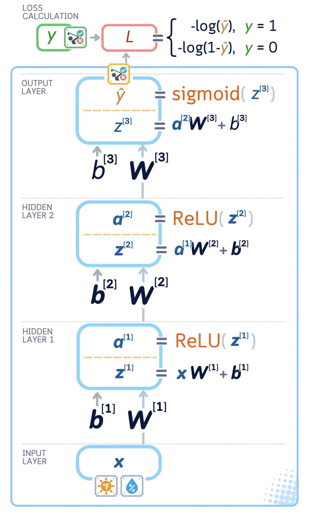
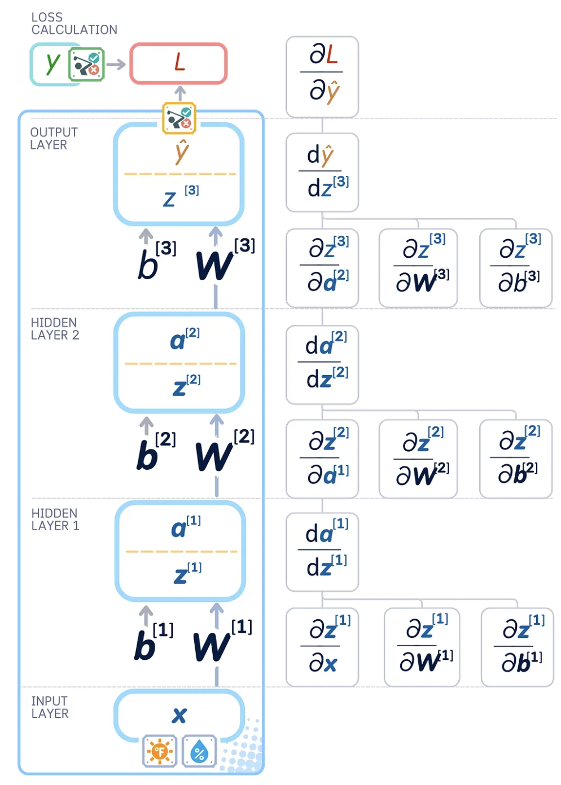
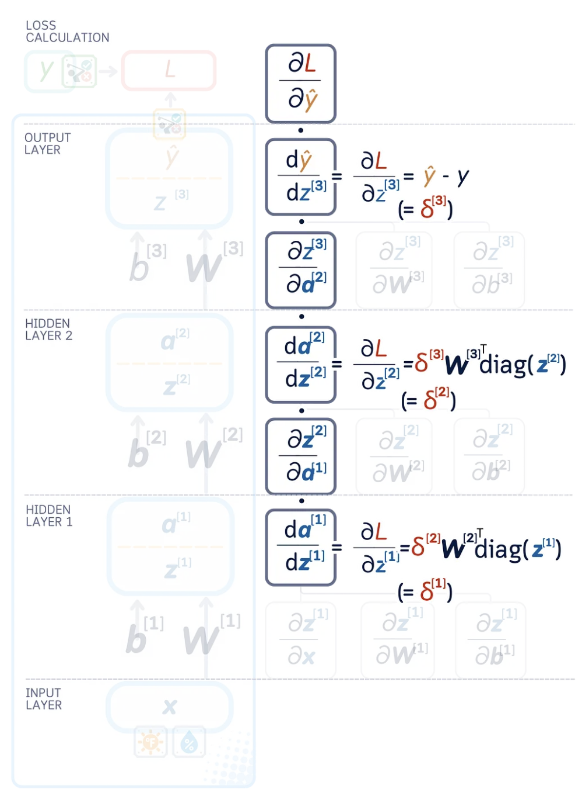

# mlp
Building an multi-layer perceptron by hand to build my understanding of the fundamentals.

### What is a Multi-Layer Perceptron (MLP), and why the name?

The name comes from the 1950's when a guy called Frank Rosenblatt introduced the single-layer perceptron, then it was seriously picked up by Geffory Hinton in the 80's [1]. 

The fact that the name MLP was coined in the 50's is reason enough why it is called a perceptron, every second new invention back then was some sort of 'tron'.

## Definition of MLP
An MLP is a type of neural network. So, let's start by defining what a neural network is. A neural net is a collection of nodes with different 'strength' connections between eachother. The gains, or 'strength', of the connections between nodes are called weights, which are tuned during a training process to embed knowledge in the network. This knowledge is accessed when a signal, which would often be a numerical expression for some input sentence, is passed through the network of nodes.

An MLP is a neural net with a very particular structure. It has an input layer, an output layer, and some number 'n' of layers sandwiched between the input and output layers. The middle layers are called 'hidden' layers. 

**Why is it structured in a sandwich like this? Well:**
- the input layer is just the entry point for your data. It is shaped depending on what your input data looks like, it's 'shape'. 
- the output layer is determined by the shape of your desired output. If it's words then you'll need a layer with a node/neuron (they're used interchangably) for each element of your vocabulary (a vocab is often not expressed by words, but often by chunks of words + words, like 'ing')
- the middle layers
    - first, if you didn't have the middle, then you would be mapping the inputs directly to the outputs, which is a *linear* relationship!
    - we want to represent more complex things than just linear relationships, which is why we introduce more layers. Note that this can be achieved by one massive single layer representing all possibly necessary functions, or, as it is done in practice, many layers of neurons stacked in series. It turns out that if you stack the layers you need fewer neurons in total vs one enormous single layer. 

## Weights, Biases, and the difference between them
The network of nodes expresses knowledge and relationship by each connection between nodes having a weight, and each node itself having a bias. The weights we have already gone over, those are the strengths between different nodes. Thinking geometrically, they are the slope and tilt of the activation of the node. They are expressed below as $w_n$. The previous nodes in the layer of n nodes preceeding the node we're inspection are represented by $x_n$ in the below equation.

Biases are the node's baseline/threashold. If the nodes preceeding the node of focus are 0, then the neuron will still fire at the bias. Adding the bias allows you to shape the baseline behaviour of the network without any activations. The output takes the form: output = activation( w1*x1 + w2*x2 + ... + wn*xn + b ). Together, the weights shape the non-linear knowledge function we're trying to represent, and the biases move it 'up' and 'down', or whatever that measn in n dimensional space haha. 

The more proper algebraically defined version of the above equation is as follows, where $\sigma!$ is just a symbol used to represent the activation function. $\sigma!$ is the same as $f$ in $f(x)$, but is just *special* becasuse this is machine learning. 

$$y = \sigma!\left( \sum_{i=1}^{n} w_i x_i + b \right) \tag{1}$$

The pre-activation version is as follows. We'll come back to this later probably. 
$$z = \sum_{i=1}^{n} w_i x_i + b \qquad y = \sigma(z) \tag{2}$$

And it may also be useful to define the vector form of the equation too.
$$y = \sigma!\left( \mathbf{w}^\top \mathbf{x} + b \right) \tag{3}$$

## How information moves through the neural net
How does the network turn inputs into useful outputs?

### Step 1: Forward Pass
Firstly, the network needs to be initialised with a set of values to start refining from. These are chosen at random to ensure the network doesn't start off with any biases baked in, that could affect the training process. The starting value range is chosen between $(-1,1)$.

Then for each node, the pre-activation weighted sum is calculated. After that, the activation function is applied (the $\sigma!$ in Equation 1). This activation function is often a Rectified Linear Unit (ReLU) function. What is a ReLU? It is a function that is positive linear when $x$ is positive, and is zero when $x$ is negative. Why apply this to the nodes? Well, at a high level an activation function is applied to allow positive values to pass unchanged and sets negative values to zero. 

  

But more specifically, the reason for applying the activation function is very cool. Suppose each layer just computes its pre-activation and passes it straight on:

$$z^{(1)} = W_1 x + b_1 \tag{4}$$

$$z^{(2)} = W_2 z^{(1)} + b_2 = W_2(W_1 x + b_1) + b_2 \tag{5}$$

Multiply that out:

$$z^{(2)} = (W_2 W_1)\, x + (W_2 b_1 + b_2) \tag{6}$$

Notice $W_2 W_1$ is just some matrix — call it $W'$ — and $W_2 b_1 + b_2$ is
just some vector $b'$. So the two-layer network is equivalent to:

$$z^{(2)} = W' x + b' \tag{7}$$

...a single linear layer. So, as Equation 7 shows, if you don't apply an activation function, your massive fancy *deep* neural network collapses into just 1 layer. The activation function is what enables a neural network to be *deep*. What you're doing, geometrically, is that by applying the non-linear activation function, you bend the space a little, meaning the stacked layers can't be represented as a linear combination and you can therefore represent useful non-linear features in your model. The way layers then connect together is shown in the below diagram.

  

The ReLU function is used specifically (vs other functions such as a Sigmoid which is also often seen) because it has the following useful properties:

1) Sparse Representations: When z is negative, the ReLU is 0 - this is called a sparse representation because you will get some sparse field of values with lots of zeros in-between. On the other hand, a sigmoid will often produce some negative number when z is negative - this is call a dense representation because you will still get lots of non-zero values. It turns out sparse representations are better for learning, and I won't try answer why.
2) Reduces the vanishing gradient problem: for ReLU, as $|x|$ increases the gradient stays constant, whereas for a sigmoid as $|x|$ increases the gradient becomes increasingly smaller, causing issues for learning. We'll get into the specifics of gradients and all those other things later don't worry.

The activation function is then computed for each layer in sequence from layer 1 through to the second last layer. If you think that sounds slow then you're right, that's what diffusion models are for (though we won't get into them here).

Now for the final layer. Remember earlier that the final layer will take the shape of whatever you want to output. If the purpose of the MLP is a classification task, then the output of the MLP will be one value found using a sigmoid. This output of the sigmoid, for the classification task, will be some probability that the input belongs to a certain category, between 0 to 1. You can see this geometrically in the above diagram, where the sigmpod function has an asymptote at 0 and 1.

If this were an LLM, your final layer may have $50,000$ nodes, one for each vocab element. Your pre-activation score will be a vector $z = [z_1, z_2, \ldots, z_V] \quad (V = \text{vocabulary size})$ where each $z_n$ corresponds to one of the $50,000$ nodes. Each node pre-activation value $z_n$ is called a logit. Only the pre-activation scores for the final layer are called logits by the way. For an LLM, instead of a sigmoid you need something called a SoftMax function, which takes the massive pre-activation vector $z$ and turns it into a single probability distribution. We won't spend more time on it, other than saying it looks like this:

$$P(\text{token } i) = \frac{e^{z_i}}{\sum_{j=1}^{V} e^{z_j}} \tag{8}$$

### Step 2: Loss Calculation
Finally on to step 2.

A loss function is a function that evaluates the difference between the model's output and the desired output; it is something we want to minimise. It is synonymous with the error function, or cost function which you may be familiar with if you have studied control theory.

  

As seen in the above figure, there are two types of loss function: classification task loss functions, and regression task loss functions. Some examples of each type of loss include:

**Classification** (predicts a category):
- Spam detection — spam or not spam
- Image labelling — cat, dog, or bird
- Next-token prediction (LLMs) — which token comes next

**Regression** (predicts a continuous value):
- House price prediction — a dollar amount
- Temperature forecasting — tomorrow's temperature
- Robot joint control — target joint angle
 
We will restrict scope to classification tasks for now. The type of function used for classification tasks is called a cross-entropy loss function. We restrict scope further here to binary cross-entropy, for when you have to decide between a yes or no. The binary cross-entropy loss function takes the form:

For a single prediction:
 
$$L = -\big[\, y \log(p) + (1 - y)\log(1 - p) \,\big] \tag{9}$$
 
where $y$ is the true label (0 or 1) and $p$ is the predicted probability of
class 1 (the sigmoid output).
 
- If $y = 1$: Equation 9 reduces to $L = -\log(p)$
- If $y = 0$: Equation 9 reduces to $L = -\log(1 - p)$
Either way, it comes out to $-\log(\text{probability assigned to the correct class})$.
 
Averaged over $N$ examples, you get the cost (loss) function:
 
$$L = -\frac{1}{N}\sum_{n=1}^{N} \Big[\, y_n \log(p_n) + (1 - y_n)\log(1 - p_n) \,\Big] \tag{10}$$
 
Now we have a loss function (Equation 10), we need to figure out how to minimise it.

### Step 4: Weight Update
Yes, we're looking at the weight updates, which is step 4, before looking at backpropogation, which is step 3 in the MLP operational sequence. This is so we understand at a high level what we're doing, then we can zoom in on one element of the weight update, which will be backpropogation. The goal of training, as stated earlier, is to find the model weights that minimise the loss function. The process of minimising that loss function is called gradient descent, and backpropogation is used in gradient descent to find the gradient vector.

What is gradient descent? Imagine you are standing on the surface shown in the below figure. This surface represents the set all the possible values your loss function can take. You want to find the minimum loss function, which means navigating to the lowest point on the surface. Note, the diagram below only has 2 weights modelled, which is the limit of what can be shown in 3D. More weights would mean more dimensions, which humans can't quite grasp.  

  

First, let me lay out the equations for gradient descent (Equations 11–13). For now, don't try understand them, just note their shape as we'll refer back to them later. 

$$f(x) = f(x_k) + \nabla f(x_k)^{\mathsf{T}}\,(x - x_k) + \text{h.o.t.} \tag{11}$$

$$\nabla f(x_k)^{\mathsf{T}} = \frac{\partial f}{\partial x} = \begin{bmatrix} \dfrac{\partial f}{\partial x_1} & \dfrac{\partial f}{\partial x_2} & \cdots & \dfrac{\partial f}{\partial x_n} \end{bmatrix} \tag{12}$$

$$x_{k+1} = x_k - h_k\,\nabla f(x_k) \tag{13}$$

How do you find that minimum point? Well, think about what you would do if you were standing on a mountain range and someone said 'make your way to the bottom of the mountains'. The first thing you would do is figure out which direction to start walking in, i.e. which direction is 'down'. This is done in gradient descent by finding the gradient vector, denoted $\nabla f(x_k)$ in Equation 13 (and defined component-wise in Equation 12). A positive gradient means the surface slopes upward, so you need to take the negative to flip around and point your direction down the slope towards the bottom of the hill, which is how you end up with $-\nabla f(x_k)$.

The other factor that has to be considered is how big each of your steps are as you walk down the hill, $h_k$. If you take small steps, you have a very safe but slow descent down the slope. If you take really big leaps you risk falling and hurting yourself. Applying this to gradient descent, small steps will gaurentee good results but just takes ages, while big steps could lead to very unstable behaviour. The formal name for the step size $h_k$ is the learning rate.

Now we can see that the expression for gradient descent in Equation 13 is really intuitive. You've got your current position $x_k$, and you subtract your next step times the direction of that step, $- h_k\,\nabla f(x_k)$. To make the connections with the equations earlier in this doc clearer, I present a mapping table below:

<table>
<tr><th>General Grad. Descent </th><th>Neural net training</th></tr>
<tr><td><code>f(x)</code> — function to minimize</td><td><code>L(w)</code> — the loss function</td></tr>
<tr><td><code>x</code> — the variable</td><td><code>w</code> — the weights</td></tr>
<tr><td><code>∇f(x_k)</code> — gradient vector</td><td><code>∇L(w_k)</code> — gradients from backprop</td></tr>
<tr><td><code>x_{k+1} = x_k − h_k ∇f(x_k)</code></td><td>the weight update step</td></tr>
<tr><td><code>h_k</code> — step size</td><td>learning rate</td></tr>
</table>

This table should make the weight update step clear too.

### Step 3: Backpropogation
In order to do the weight update step, we need to know the gradient vector. This is done using backpropogation. To illustrate Step 3 I will rely heavily on the illustrations done by Samy Baladram in his Medium article linked [here](https://medium.com/data-science/multilayer-perceptron-explained-a-visual-guide-with-mini-2d-dataset-0ae8100c5d1c).

As hinted at above, given we're trying to minimise the loss by varying the weights, the gradient vector (the neural-net version of Equation 12) will take the form: 

$$\nabla f(x_k) = \nabla L(w_k) = \left[ \frac{\partial L}{\partial w_1}, \frac{\partial L}{\partial w_2}, \dots, \frac{\partial L}{\partial w_n} \right] \tag{14}$$

So, how do we find $\frac{\partial L}{\partial w_k}$? We will use the chain rule to examine the effect of each layer's weights and biases on the loss - to do so we'll evaluate the partial derivatives of all the elements of the MLP. With the way we've set up the partial derivatives, you will see that the result of the chain rule will cancel out to be $\frac{\partial L}{\partial w_k}$. 

<table>
<tr>
<td align="center"></td>
<td align="center"><h1>⟶</h1><em>take partial derivative of each element</em></td>
<td align="center"></td>
</tr>
</table>

Delving into the specific calculus rules used to find the respective partial derivatives for each element of the MLP is probbaly out of scope for this tutorial, so I will just skip to showing a table of all the solutions to the partial derivatives in the diagram above.

| Layer | Forward pass | Local gradients |
|---|---|---|
| **Loss** | $L = -y\log(\hat{y}) - (1-y)\log(1-\hat{y})$ | $\dfrac{\partial L}{\partial \hat{y}} = \dfrac{\hat{y} - y}{\hat{y}(1-\hat{y})}$ |
| **Output** | $\hat{y} = \sigma(z^{[3]})$ | $\dfrac{d\hat{y}}{dz^{[3]}} = \hat{y}(1-\hat{y})$ |
| **Output** | $z^{[3]} = a^{[2]}W^{[3]} + b^{[3]}$ | $\dfrac{\partial z^{[3]}}{\partial a^{[2]}} = W^{[3]\top} \qquad \dfrac{\partial z^{[3]}}{\partial W^{[3]}} = a^{[2]\top} \qquad \dfrac{\partial z^{[3]}}{\partial b^{[3]}} = 1$ |
| **Hidden 2** | $a^{[2]} = \text{ReLU}(z^{[2]})$ | $\dfrac{da^{[2]}}{dz^{[2]}} = \text{diag}(z^{[2]})$ |
| **Hidden 2** | $z^{[2]} = a^{[1]}W^{[2]} + b^{[2]}$ | $\dfrac{\partial z^{[2]}}{\partial a^{[1]}} = W^{[2]\top} \qquad \dfrac{\partial z^{[2]}}{\partial W^{[2]}} = a^{[1]\top} \qquad \dfrac{\partial z^{[2]}}{\partial b^{[2]}} = I$ |
| **Hidden 1** | $a^{[1]} = \text{ReLU}(z^{[1]})$ | $\dfrac{da^{[1]}}{dz^{[1]}} = \text{diag}(z^{[1]})$ |
| **Hidden 1** | $z^{[1]} = xW^{[1]} + b^{[1]}$ | $\dfrac{\partial z^{[1]}}{\partial x} = W^{[1]\top} \qquad \dfrac{\partial z^{[1]}}{\partial W^{[1]}} = x^{\top} \qquad \dfrac{\partial z^{[1]}}{\partial b^{[1]}} = I$ |

You then multiply these through to get each weight and bias partial derivative, i.e. the components $\frac{\partial L}{\partial w_k}$ that make up the gradient vector in Equation 14!

However, we don't use the raw partial derivatives. Instead, we calculate layer errors, the gradient with respect to the pre-activation outputs, $\frac{\partial L}{\partial z_l} = \delta^{[l]}$ which help determine how much we should adjust the weights and biases in earlier layers. From a reductionist viewpoint, all we're doing here is calculating an intermediate variable that can be reused recursively instead of recalculating the expression at each stage of backprop, which when you're doing this calculation millions of times creates a lotttt of time and energy savings. The process of recursively calculating the layer errors looks like this:

  

Applying the chain rule again and using the layer errors we can now find the weight and biases gradients. 